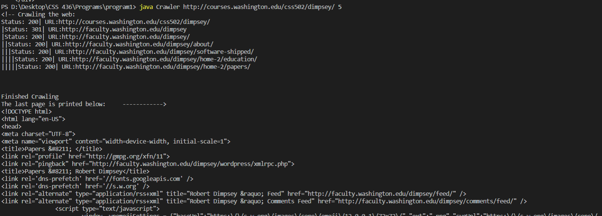

# Program 1: Webcrawler

This program is a Webcrawler that jumps through websites a specified number of times and starting from a provided url.

I wrote this program in java. It doesn't need any libraries, dependencies, or build tools. Compile the Crawler.java and run the program. I compiled and ran the program on Linux (with java 14) and Windows (with java 15) machines without issues.

When I tested the program using the css labs, I couldn't compile my code. They have a very old version of java.

This program should be able to work with java 11, but I couldn't test that because I don't have java 11.

To run the program:

```
javac Crawler.java
java Crawler http://courses.washington.edu/css502/dimpsey/ 30
```

I represent hops by a vertical bar, "|". I don't count visiting the starting url as a hop.

I parse pages with regex. I assume, among other things, anchors will end with `</a>`.

I keep track of the pages I visit by using a hashset. I backtrack with a stack. 

I handle redirections (3xx) manually so I can print them, but I don't count them as hops. If links with trailing slashes redirect to one without or vice versa, then my program only counts that as one hop. If both links return 200, then each will be considered a different webpage (since they are).

I attempt requests thrice for server error responses (5xx).

The program terminates when the specified number of hobs is reached, there are no more pages to visit, or the last visited page had no embedded urls. If you want to change the program so it doesn't terminate if the last page had no embedded urls, please look at the comments for response status 2xx.

## Output
The output for ``` java Crawler http://courses.washington.edu/css502/dimpsey/ 50 ``` is in output.html. You can't open it with your browser because it has relative links for css and js files.

Here is a screenshot as well.



