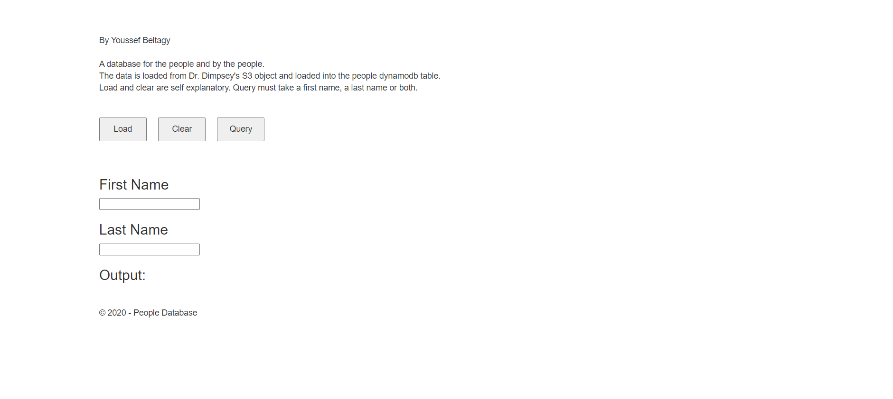
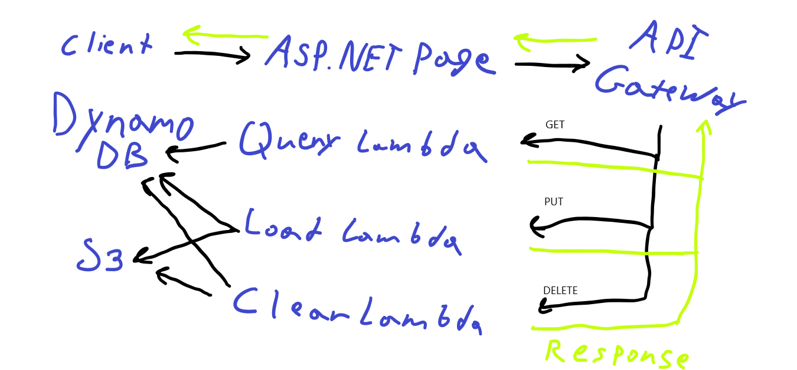
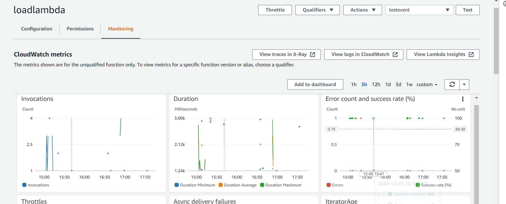

# Program 4 report

By Youssef Beltagy

Here is the webpage url (Link no longer works): https://nosqldatabase-website.azurewebsites.net

Here is the s3 object url (Link no longer works): https://chicken-in-the-cloud.s3-us-west-2.amazonaws.com/text.txt

Here is the API url (Link no longer works): https://svj981o6h4.execute-api.us-west-2.amazonaws.com/prod

## Design

I didn't make a website. I made a restful API using AWS's lambdas. The website itself is just a way to use the API.

Initially, I intended to write JavaScript code that will execute in the user's browser, make the API calls, and display the results. However, because of CORS issues, I couldn't do that. So I made an asp.net webpage. If I was more experienced with JavaScript, I could have figured it out.

I wrote Lambda functions to handle all the logic. I provide access to these lambda functions through AWS's API-Gateway. I use GET to query the database, PUT to load data into the database, and DELETE to clear the database.

In this design diagram, the request is black and the response is green.

## Scale

The website itself is unimportant and can be scaled horizontally without issues. The API is the bottle neck.

API Gateway and lambda can scale horizontally without issues. They don't even need distributed algorithms.

Because the logic can be scaled horizontally without issues, I expect the bottleneck here to be the storage. The storage must use distributed algorithms to maintain consistency. But since I'm using S3 and DynamoDB, AWS ensures high-scalability for my storage.

With the current code, this API/Site can be scaled to enterprise sizes without issues. So, I can automate the scaling of this application. I just need the money and incentive to scale it.

## Monitoring

I monitor my API through Cloud Watch. But because I made three separate lambdas, getting a full view of the website is cumbersome. I can find out exactly how many times each lambda was called, though.

In fact, I can monitor S3 and DynamoDB through Cloud Watch as well. I get a lot of information, including the PUT latency of the table.

But my opinion is that all of this information is useless right now because nobody uses my awesome API.

I monitor my APS.NET site through Azure's monitoring. But I don't care about it much. It is simply a way for you to access the API.

## Function logic

All of my lambdas are in python.

Loadlambda copies Dr. Dimpsey's object to my bucket (with public access) and then uses my object to fill up the DynamoDB table.

Clearlambda removes the s3 object and clears the database using scan.

Querylambda requires at least one input. Querylambda searches for a single entry if it is given both a last name and a first name. If only the last name was given, Querylambda uses the query DynamoDB API method to get all entries with the give last name. If only the last name was give, QueryLambda uses the scan DynamoDB API method to get all entries with the given first name.

## SLA

I can multiply the SLA of the services to get an estimation of my service's SLA.

However, without agreeing on a more granular definition, it is hard to get a more precise SLA. I considered getting an SLA per Lambda. Then, for example, I would multiply the s3 SLA twice for Loadlambda because Loadlambda makes two requests to s3. However, that isn't meaningful unless I get a per-transaction SLA from Azure and AWS.

The API's SLA is 0.999 \* 0.9999 \* 0.9995 \* 0.9995 (s3 \* DynamoDB \* lambda \* API-Gateway) = 0.99790144962. The SLA for my API is 99.79%.

The Website's SLA is 0.99790144962 * 0.9995 (my-API \* App-services) = 0.99740249889. The SLA for my website is 99.74%.

### S3

https://aws.amazon.com/s3/sla/

99.9%

### DynamoDB

https://aws.amazon.com/dynamodb/sla/

99.99%

### Lambda

https://aws.amazon.com/lambda/sla/

99.95%

### API Gateway

https://aws.amazon.com/api-gateway/sla/

99.95%

Since API Gateway is simply a forwarding service, I'm surprised it isn't close to 100%. Maybe because it ultimately points to a Lambda or a VM which has a 99.95% SLA? I think that makes sense, however, I will still take AWS's SLA at face value and use it.

### Azure SLA
https://azure.microsoft.com/en-us/support/legal/sla/app-service/v1_4/

99.95%

